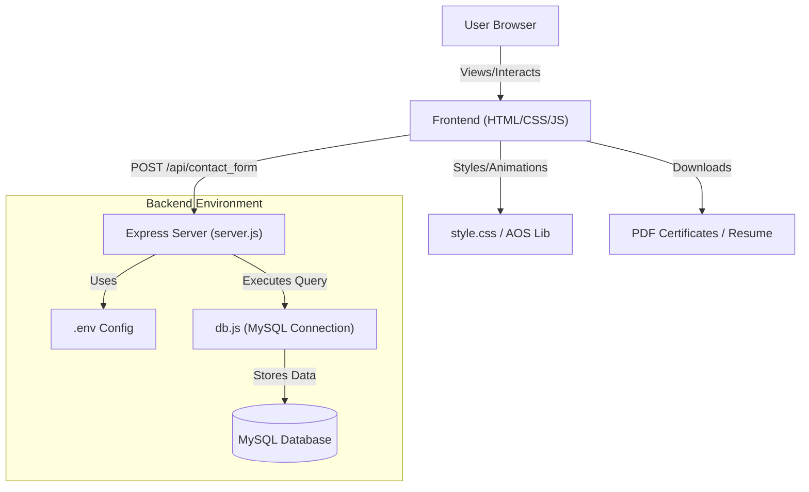

# My-Portfolio
Personal portfolio built with modern web technologies to showcase projects, skills, and experience.

This repository, `swaliha-Mujawar-CM-AC/My-Portfolio`, contains the source code for a professional personal portfolio website. It is designed to showcase the developer's technical skills, educational background, certifications, and professional experience. The project combines a responsive frontend with a functional backend service for handling user inquiries.

## 1. What is this repo?
The repository serves as a digital resume and project hub for Swaliha Mujawar, a Computer Science Engineer currently pursuing a PGCP-AC at CDAC Kharghar, Mumbai. The site is built using a "traditional" but robust stack: HTML, CSS, and Vanilla JavaScript for the frontend, with a Node.js and Express backend to manage data persistence.

The portfolio is structured to provide a comprehensive view of the developer's profile, including:
*   **Professional Summary**: An interactive "About Me" section highlighting a tech stack that includes Java, SQL, C++, and modern web technologies.
*   **Academic Journey**: A vertical timeline in `My-Portfolio-master/My-Portfolio-main/index.html` detailing education from secondary school to post-graduate studies.
*   **Experience & Internships**: Details regarding a .NET internship at ARK Solutions and other industrial exposures.
*   **Digital Credentials**: A grid of certificates (provided as PDF files in the root of the project) covering topics like Ethical Hacking, Industry 4.0, and AI web tools.
*   **Contact Management**: A backend system to capture and store messages from potential recruiters or collaborators.

## 2. How all main components connect
The architecture follows a classic Client-Server model. The frontend is a single-page application (SPA) style layout where navigation links jump to specific IDs on the same page.

### Component Interaction Flow
1.  **Frontend (UI/UX)**: The user interacts with `My-Portfolio-master/My-Portfolio-main/index.html`. Visual effects are handled by `My-Portfolio-master/My-Portfolio-main/style.css` and third-party libraries like **AOS (Animate On Scroll)** for entry animations and **Typed.js** (implemented via custom script) for the hero section's typing effect.
2.  **Theme Engine**: A JavaScript-based toggle in `My-Portfolio-master/My-Portfolio-main/index.html` switches between `light-theme` and `dark-theme` classes on the `<body>` tag, altering the CSS variables defined in the stylesheet.
3.  **Lead Capture**: When a user submits the contact form, a `fetch` request is triggered in the frontend JavaScript. This request targets the `POST /api/contact_form` endpoint.
4.  **Backend Processing**: The Express server in `My-Portfolio-master/My-Portfolio-main/backend/server.js` receives the JSON payload. It validates the input and uses the `mysql` driver to execute an `INSERT` query.
5.  **Data Persistence**: The data is stored in a MySQL database named `portfolio_db`, as configured in `My-Portfolio-master/My-Portfolio-main/backend/db.js`.



## 3. Repository Structure

```shell
swaliha-Mujawar-CM-AC/My-Portfolio/
├── My-Portfolio-master/
│   └── My-Portfolio-main/
│       ├── .vscode/
│       │   ├── launch.json
│       │   └── settings.json
│       ├── backend/
│       │   ├── .env
│       │   ├── db.js
│       │   ├── package.json
│       │   └── server.js
│       ├── bootstrap-5.3.7-dist/
│       │   └── bootstrap-5.3.7-dist/
│       ├── ARK Solution Internship.pdf
│       ├── Ethical Hacking.pdf
│       ├── Swaliha_Mujawar_Resume.docx
│       ├── index.html
│       ├── style.css
│       ├── llogo.png
│       └── swaliha mujawar.jpg
└── README.md
```

## 4. Other important information

### Tech Stack Details
*   **Frontend**: Built with HTML5 and CSS3 (utilizing Flexbox/Grid). It uses **Bootstrap 5.3.7** (stored locally in `My-Portfolio-master/My-Portfolio-main/bootstrap-5.3.7-dist/`) for the grid system and off-canvas mobile menus.
*   **Backend**: A Node.js environment. The `My-Portfolio-master/My-Portfolio-main/backend/package.json` reveals dependencies on `express` for routing, `mysql` for database connectivity, `cors` for cross-origin resource sharing, and `dotenv` for environment variable management.
*   **Animations**: The project uses **AOS.js** for scroll-triggered reveals and a custom `setInterval`-based typing animation for the "I'm a..." text in the hero section.

### Key Implementation Specifics
1.  **Contact Form Logic**: The file `My-Portfolio-master/My-Portfolio-main/backend/server.js` contains a hardcoded fallback for the database connection but prefers environment variables defined in `My-Portfolio-master/My-Portfolio-main/backend/.env`.
2.  **Visual Assets**: The portfolio is heavy on personalized assets. It includes multiple versions of logos (`logo.png`, `logo2.png`, `logo3.png`) and several profile images used in the "About" and "Contact" sections.
3.  **PDF Hosting**: Rather than linking to external drives, the developer has included certification PDFs (e.g., `My-Portfolio-master/My-Portfolio-main/Ethical Hacking.pdf`) directly in the repository, allowing for high-speed local serving and "View Certificate" functionality via the `target="_blank"` attribute in `index.html`.
4.  **Dev Tools**: The `.vscode/settings.json` file specifies that the project is configured for use with the **Live Server** extension on port 5501, while the backend runs on port 5500, necessitating the `cors` middleware found in the server code.

### Database Schema
Based on the query in `My-Portfolio-master/My-Portfolio-main/backend/server.js`, the backend expects a table named `contact_form` with the following columns:
*   `name`: (String/Varchar)
*   `email`: (String/Varchar)
*   `message`: (Text)
*   `id`: (Typically an auto-incrementing primary key, though not explicitly shown in the JS code).
